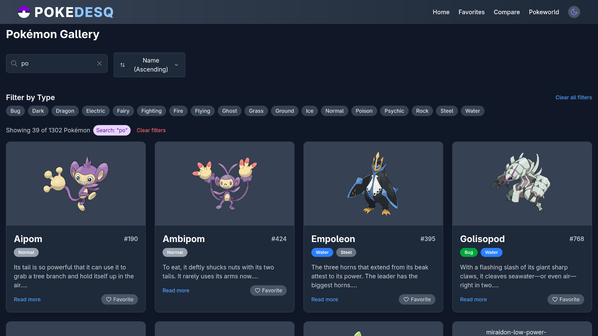

# Pokedesq

A comprehensive Pokémon search, filter, and sorting application built with React and the PokéAPI. Explore detailed Pokémon stats, manage your favorites, and enjoy a seamless browsing experience with optimized performance.

🔗 **Live Demo**: [https://pokedesq.vercel.app](https://pokedesq.vercel.app)

## Features

- **Advanced Search & Filter**: Search Pokémon by name and filter by various criteria
- **Detailed Stats Display**: View comprehensive Pokémon information including stats, abilities, and types
- **Sorting Options**: Sort Pokémon by different attributes for better organization
- **Favorites System**: Save your favorite Pokémon with persistent localStorage integration
- **Optimized Performance**: Built with React optimization techniques (useMemo, useCallback, React.memo)
- **Responsive Design**: Fully responsive interface built with Tailwind CSS
- **Loading & Error States**: Enhanced user experience with proper loading and error handling
- **Fast Navigation**: Smooth routing with React Router
- **Central State Management**: Central state management by the help of context API

## Screenshots



## Tech Stack

- **Frontend**: React.js, JavaScript
- **Styling**: Tailwind CSS
- **API**: PokéAPI
- **Routing**: React Router
- **State Management**: Context API with custom hooks
- **Storage**: localStorage
- **Deployment**: Vercel

## Installation & Setup

### Prerequisites

- Node.js (version 14 or higher)
- npm or yarn package manager

### Clone and Run

```bash
# Clone the repository
git clone https://github.com/vanshgora/pokedesq.git

# Navigate to the project directory
cd pokedesq

# Install dependencies
npm install

# Start the development server
npm run dev
```

The application will be available at `http://localhost:3000`

## Usage

1. **Search Pokémon**: Use the search bar to find specific Pokémon by name
2. **Filter Results**: Apply filters to narrow down your search results
3. **Sort Options**: Sort Pokémon by different attributes like name, ID, or stats
4. **View Details**: Click on any Pokémon card to view detailed information
5. **Manage Favorites**: Click the heart icon to add/remove Pokémon from favorites
6. **Navigate**: Use the navigation to explore different sections of the app

## Project Structure

```
pokedesq/
├── src/
│   ├── assets/         # Static Images used in the project
│   ├── Components/     # Reusable UI components
│   ├── Contexts/       # Context API providers
│   ├── Hooks/          # Custom React hooks
│   ├── Services/       # API service functions
│   ├── utils/          # Helper functions
│   └── styles/         # Global styles and Tailwind config
├── public/             # Public assets
└── package.json
```

## Performance Optimizations

- **React.memo**: Prevents unnecessary re-renders of components
- **useMemo**: Memoizes expensive calculations and filtered data
- **useCallback**: Optimizes function references to prevent child re-renders
- **Context API**: Efficient state management across components
- **Custom Hooks**: Reusable logic for data fetching and state management
- **Loading States**: Smooth user experience during API calls

## API Integration

This application uses the [PokéAPI](https://pokeapi.co/) GraphQl version to fetch Pokémon data:
- Pokémon basic information
- Detailed stats and abilities
- Type information
- Evolution chains
- Sprites and images

## Contributing

Contributions are welcome! Please follow these steps:

1. Fork the repository
2. Create a feature branch (`git checkout -b feature/amazing-feature`)
3. Commit your changes (`git commit -m 'Add amazing feature'`)
4. Push to the branch (`git push origin feature/amazing-feature`)
5. Open a Pull Request

## Development Guidelines

- Follow React best practices and hooks patterns
- Maintain consistent code formatting
- Add proper error handling for API calls
- Optimize performance with React optimization techniques
- Write meaningful commit messages

## Deployment

This application is deployed on Vercel with automatic deployments from the main branch.

To deploy your own version:
1. Fork this repository
2. Connect your GitHub account to Vercel
3. Import the project and deploy

## Future Enhancements

- [ ] React Error Boundries
- [ ] Pokemon comparison tool
- [ ] Advanced battle calculator
- [ ] Team builder functionality
- [ ] Offline caching with service workers
- [ ] Pokemon evolution tree visualization
- [ ] Move details and effectiveness chart
- [ ] User authentication and cloud sync
- [ ] Mobile app version


## Contact

**Vansh Gora**
- 📧 Email: vanshgora31@gmail.com
- 🔗 LinkedIn: [linkedin.com/in/vanshgora](https://linkedin.com/in/vanshgora)
- 🐙 GitHub: [github.com/vanshgora](https://github.com/vanshgora)
- 📱 Phone: +91 7060496976

## Acknowledgment
- [PokéAPI](https://pokeapi.co/) for providing comprehensive Pokémon data
- The Pokémon Company for creating the amazing world of Pokémon
- React community for excellent documentation and resources
- Vercel for seamless deployment platform

---

Built with ❤️ by Vansh Gora